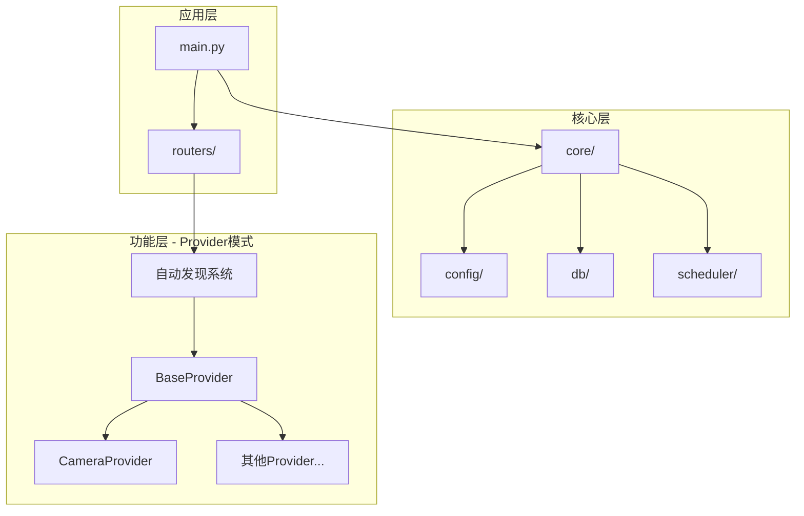
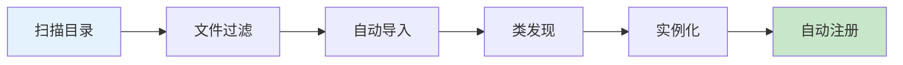
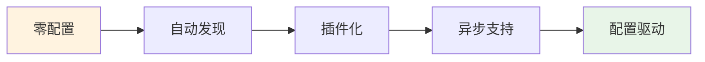

# HomeGuard 项目架构

## 🏗️ 架构模式

### 核心架构图



### Provider 自动发现模式



## 📁 项目结构

```
HomeGuard/
├── main.py                    # 入口
├── configs/config.yml         # 配置
├── src/
│   ├── core/                  # 核心模块
│   │   ├── config/           # 配置管理
│   │   ├── db/               # 数据库层
│   │   ├── scheduler/        # 任务调度
│   │   └── utils/            # 工具函数
│   ├── providers/            # 🔑 Provider模式
│   │   ├── __init__.py       # 自动发现系统
│   │   ├── base_provider.py  # 基类
│   │   └── camera/           # 相机模块
│   └── routers/              # API路由
└── example/                   # 示例代码
```

## 🎯 设计模式

### 1. Provider 模式
- **自动发现**: 零配置加载新模块
- **插件化**: 继承 `BaseProvider` 即可
- **配置驱动**: YAML 控制启用状态

### 2. 仓储模式
- **数据抽象**: `repositories/` 层
- **模型分离**: `models/` 定义
- **统一接口**: 标准数据访问

### 3. 分层架构
- **应用层**: 程序入口和路由
- **核心层**: 基础服务和工具
- **功能层**: 业务模块 (Provider)

## 🚀 核心特性



- ✅ **零配置扩展**: 新 Provider 自动加载
- ✅ **异步优先**: 支持高并发
- ✅ **模块化**: 功能独立封装
- ✅ **容错设计**: 单模块失败不影响整体

## 📋 当前实现

- **Camera Provider**: 拍照、录像、参数控制
- **Task System**: 任务调度和管理
- **MCP Protocol**: 协议服务支持
- **Config Management**: YAML 配置系统